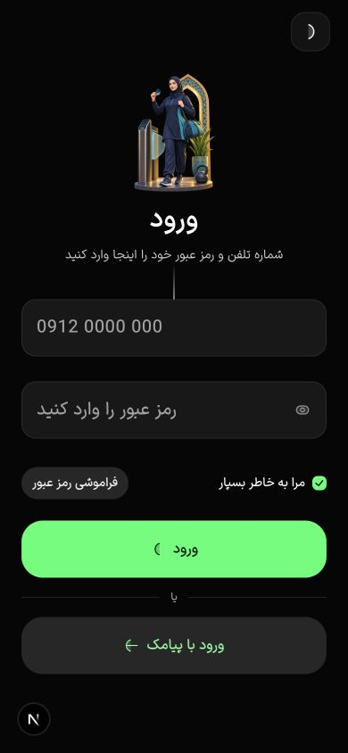
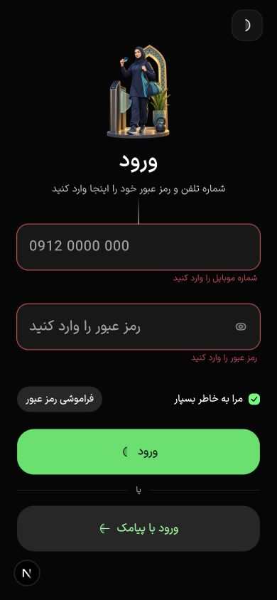
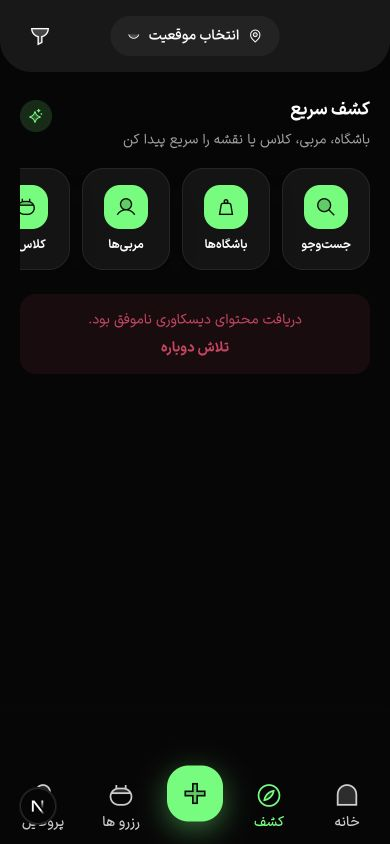
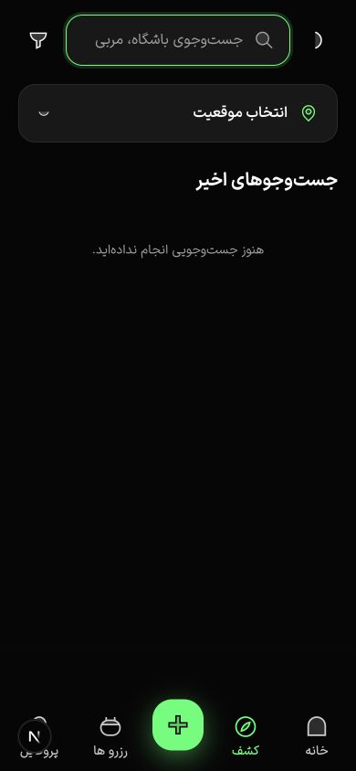
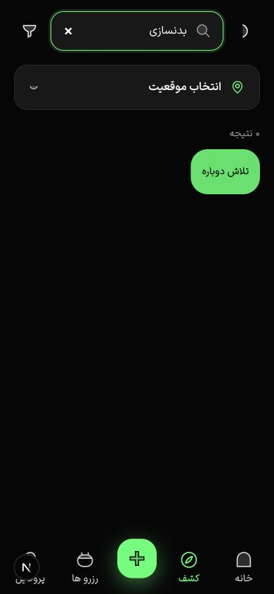
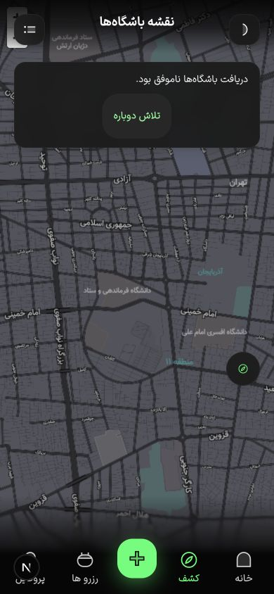

# ارزیابی محصول و اپ Gym4Me

تاریخ بررسی: ۱۵ شهریور ۱۴۰۵ / ۵ سپتامبر ۲۰۲۶

## جمع‌بندی مدیریتی

Gym4Me از نظر وسعت محصول، هویت بصری و معماری اولیه از یک MVP معمولی جلوتر است. مسیرهای کشف باشگاه، مربی و کلاس، رزرو، پرداخت، کیف پول، عضویت، حضور با QR، لیست انتظار، پشتیبانی، اعلان و پنل‌های ادمین/باشگاه در کد دیده می‌شوند. با این حال نسخه فعلی برای انتشار عمومی آماده نیست، چون API به‌دلیل خطای تزریق وابستگی در `SupportModule` بالا نمی‌آید و در نتیجه مسیر اصلی کاربر تا رزرو و پرداخت عملاً قابل استفاده نیست.

- امتیاز بلوغ محصول و کد: **۷٫۵ از ۱۰**
- امتیاز آمادگی انتشار در وضعیت فعلی: **۵٫۴ از ۱۰**
- پیشنهاد تصمیم: **توقف افزودن فیچر جدید و یک دوره تثبیت ۲ تا ۴ هفته‌ای روی قیف اصلی**

## امتیازها

| زاویه بررسی | امتیاز | خلاصه |
| --- | ---: | --- |
| ارزش محصول و مسئله | ۸٫۳ | مسئله واقعی و مدل چندطرفه قوی؛ دامنه محصول روشن است. |
| وسعت و کامل‌بودن فیچرها | ۸٫۸ | فیچرهای مالی، رزرو، حضور، لیست انتظار، پشتیبانی و عملیات فراتر از MVP ساده‌اند. |
| طراحی بصری و برند | ۸٫۶ | زبان بصری متمایز، RTL مناسب، تصاویر باکیفیت و CTAهای واضح. |
| تجربه کاربری و معماری اطلاعات | ۷٫۲ | مسیر کلی قابل فهم است، اما چند CTA مبهم و حالت‌های خطا متناقض‌اند. |
| دسترس‌پذیری | ۶٫۳ | برچسب‌ها و اندازه لمس عموماً خوب‌اند؛ اسلایدها، اسپلش و اعلام خطا نیاز به اصلاح دارند. |
| معماری و کیفیت کد | ۸٫۱ | monorepo، TypeScript، قرارداد API مشترک، CI و ماژول‌بندی خوب. |
| امنیت و حریم خصوصی | ۷٫۵ | Android Keystore، AES-GCM، refresh rotation، throttling و HTTPS وجود دارد؛ CSP و parity آی‌اواس ناقص‌اند. |
| کارایی و حجم اپ | ۶٫۶ | تصاویر شروع حدود ۱۵ مگابایت از ۱۸ مگابایت public را می‌سازند و خروجی Capacitor حدود ۴۳ مگابایت است. |
| پایداری و تست‌پذیری | ۵٫۷ | ۱۳۵ تست بک‌اند پاس شد، ولی bootstrap واقعی API خراب است و تست فرانت/flow وجود ندارد. |
| آمادگی بازار و عملیات | ۶٫۰ | زیرساخت محصول قوی است؛ درگاه واقعی، کیفیت عرضه، پشتیبانی و پایلوت عملیاتی هنوز تعیین‌کننده‌اند. |

## جریان بررسی‌شده

### گام ۱ — شروع کاربر جدید — وضعیت: خوب

صفحه شروع واضح، متمرکز و از نظر تصویر و CTA قوی است. متن فرعی کمی کلی است و ارزش اصلی «پیدا کردن و رزرو کردن» را مستقیم بیان نمی‌کند.

### گام ۲ — معرفی امکانات — وضعیت: خوب با ریسک اعتماد و دسترس‌پذیری

تصاویر و سلسله‌مراتب خوب‌اند. در اسلاید آخر، فلش همان برچسب «اسلاید بعدی» را دارد و مشخص نیست که کار را تمام می‌کند. اسلایدهای غیرفعال نیز در DOM دسترس‌پذیری حاضرند؛ خواننده صفحه ممکن است هر چهار اسلاید را یک‌جا بخواند. همچنین وعده «امتیاز تناسب اندام شخصی‌سازی‌شده» و «پیشرفت روزانه» مسیر محصول واضحی در اپ ندارد و می‌تواند اعتماد را کم کند.

### گام ۳ — انتخاب روش ورود — وضعیت: خوب

دو مسیر پیامک و رمز عبور روشن و قابل تشخیص‌اند. تصویر بخش زیادی از ارتفاع را می‌گیرد، ولی CTAهای اصلی هنوز در دسترس هستند. نام دسترس‌پذیر تیتر در DOM به شکل تکراری «Gym4Me Gym4Me» دیده شد.

### گام ۴ — ورود با رمز و اعتبارسنجی — وضعیت: خوب

فرم ساده، اندازه کنترل‌ها مناسب و مسیر بازیابی رمز روشن است. خطاها کنار فیلد نمایش داده می‌شوند، اما متن کوچک و کم‌قدرت است و بهتر است علاوه بر رنگ، آیکن/خلاصه خطا و انتقال فوکوس به اولین خطا هم اضافه شود.

### گام ۵ — صفحه کشف — وضعیت: ضعیف در شرایط واقعی فعلی

کشف سریع و ناوبری پایین خوب طراحی شده‌اند، اما API قطع است و صفحه تقریباً خالی می‌شود. کارت خطا فقط «تلاش دوباره» دارد و علت، حالت آفلاین یا امکان مشاهده داده قبلی را توضیح نمی‌دهد. اکشن مرکزی `+` برای ورزشکار به صفحه جست‌وجو می‌رود؛ این نماد معنای «ایجاد» می‌دهد و با عمل واقعی سازگار نیست.

### گام ۶ — جست‌وجو — وضعیت: نیازمند اصلاح

ورودی، فیلتر و موقعیت ساختار خوبی دارند. در شکست API هم‌زمان «۰ نتیجه» و «تلاش دوباره» نمایش داده می‌شود؛ کاربر نمی‌فهمد جست‌وجو نتیجه ندارد یا سرویس خراب است. خطا باید جای شمارش نتیجه را بگیرد و پیام مستقل با اقدام جایگزین ارائه کند.

### گام ۷ — نقشه — وضعیت: متوسط

نقشه، برگشت به لیست و موقعیت فعلی قابل فهم‌اند. کارت خطا بزرگ است و بخش زیادی از نقشه را می‌پوشاند. در قطع API بهتر است نقشه همچنان قابل استفاده بماند، آخرین نتایج cache‌شده نمایش داده شوند و خطا به یک banner کوچک‌تر تبدیل شود.

## یافته‌های فنی مهم

1. **P0 — API بالا نمی‌آید.** `JwtAuthGuard` داخل `SupportModule` به `TokenService` دسترسی ندارد؛ `AuthModule` در imports این ماژول نیست. TypeScript، lint و build این خطا را پیدا نمی‌کنند.
2. **P0 — تست smoke برای bootstrap وجود ندارد.** CI تست و build دارد، اما `NestFactory.create(AppModule)` یا health-check روی سرور واقعی اجرا نمی‌کند؛ به همین دلیل ۱۳۵ تست سبز هستند ولی سرویس واقعی crash می‌کند.
3. **P0 در صورت انتشار iOS — نگهداری امن توکن فقط Android است.** `secureTokenStorage.isAvailable()` فقط Android را برمی‌گرداند، اما `AppApiProvider` persistence بومی را برای هر پلتفرم native پیکربندی می‌کند. پلاگین متناظر Swift و pipeline انتشار iOS هم وجود ندارد.
4. **P1 — تست فرانت‌اند وجود ندارد.** هیچ تست component، integration یا E2E برای اپ، پنل باشگاه و پنل ادمین پیدا نشد.
5. **P1 — تصاویر بیش از حد سنگین‌اند.** `public` حدود ۱۸MB است؛ تصاویر welcome/onboarding/permissions عمدتاً ۱ تا ۲٫۳MB هستند. در Capacitor، Next Image بهینه‌سازی runtime ندارد و فایل کامل در بسته قرار می‌گیرد.
6. **P1 — خطای جست‌وجو با empty state مخلوط شده است.** شمارنده قبل از شاخه `isError` رندر می‌شود.
7. **P1 — دسترس‌پذیری onboarding ناقص است.** اسلاید غیرفعال `aria-hidden`/`inert` نیست، دکمه قبلی در اسلاید اول disabled نیست و اکشن نهایی برچسب پایان ندارد.
8. **P2 — انتخاب متن سراسری غیرفعال است.** آدرس باشگاه، شماره تماس، کد پیگیری و پیام خطا در نسخه وب قابل copy نیستند.

## کارهای لازم به ترتیب اولویت

### P0 — قبل از هر پایلوت

- رفع bootstrap بک‌اند و افزودن تست ساخت کامل `AppModule` و health-check در CI.
- اجرای مسیر واقعی `کشف → جزئیات → سانس → رزرو → پرداخت → اعلان → لغو/refund` روی Android واقعی.
- اتصال درگاه بانکی واقعی، callback امضاشده، reconciliation زمان‌بندی‌شده و گزارش مغایرت.
- فعال‌سازی production برای MongoDB، Redis، Object Storage، پیامک، Firebase Push، Neshan و Sentry.
- تفکیک کامل حالت‌های loading، empty، offline، timeout، permission denied و server error.
- انتشار عمومی صفحات privacy، terms، support و account deletion و تکمیل Data Safety.
- افزودن تست E2E فرانت برای ورود، جست‌وجو، رزرو، پرداخت و حذف حساب.
- اگر iOS در scope است: Secure Storage/Keychain، biometrics، push، deep link، build/release و تست دستگاه واقعی.

### P1 — برای پایلوت کنترل‌شده

- freeze فیچر و تمرکز روی قیف اصلی و نرخ موفقیت رزرو.
- بهینه‌سازی تصاویر به WebP/AVIF با سایزهای واقعی و preload فقط تصویر اول.
- اصلاح onboarding: وعده منطبق با محصول، «تمام/ورود به اپ»، skip، disabled state و مخفی‌سازی اسلاید غیرفعال از screen reader.
- اصلاح اکشن مرکزی ورزشکار از `+` به جست‌وجو/اسکن/اقدام سریع معنادار.
- بازطراحی error recovery با cache آخرین داده، retry کنترل‌شده و پیام قابل فهم.
- تست TalkBack، VoiceOver، فونت بزرگ، zoom/reflow و contrast واقعی؛ از روی screenshot نمی‌توان WCAG را تأیید کرد.
- پایلوت متمرکز در یک شهر/منطقه با ۲۰ تا ۵۰ باشگاه یا مربی تأییدشده و داده سانس تازه.
- تعریف عملیات بررسی مدارک، کیفیت عکس و اطلاعات، dispute، refund، no-show و SLA پشتیبانی.

### P2 — پس از اثبات قیف

- تکمیل همان وعده‌های onboarding: fitness assessment واقعی، داشبورد پیشرفت، حضور، رکوردها و streak.
- UX جابه‌جایی رزرو، ادامه پرداخت نیمه‌کاره و نمایش شفاف waitlist/hold.
- SLA و escalation خودکار تیکت، revoke مستقل تقویم و export حجیم background.
- پیشنهادهای نزدیک و شخصی‌سازی rule-based با کنترل کیفیت و توضیح «چرا این پیشنهاد».
- کمپین‌های بازگشت کاربر، referral کنترل‌شده، بسته/عضویت و وفاداری؛ فقط بعد از پایدارشدن پرداخت.

## معیارهای پیشنهادی

- North Star: تعداد حضور موفق هفتگی.
- نرخ جست‌وجوی موفق، detail→slot، slot→checkout، checkout→paid و paid→attended.
- نرخ خطای پرداخت/callback، رزرو ناموفق، لغو، refund و no-show.
- رزرو مجدد ۳۰روزه، fill rate سانس، تازگی برنامه باشگاه و تیکت به ازای ۱۰۰ رزرو.
- crash-free users، startup time، حجم دانلود و p95 پاسخ API.

## نتیجه بررسی‌های اجرایی

- TypeScript اپ: پاس
- lint اپ: پاس
- TypeScript بک‌اند: پاس
- lint/format بک‌اند: پاس
- build بک‌اند: پاس
- build production اپ: پاس
- export Capacitor: پاس، ۷۴ صفحه static/SSG
- تست بک‌اند: ۳۵ suite و ۱۳۵ تست، همگی پاس
- اجرای واقعی بک‌اند: fail به‌علت dependency resolution در `SupportModule`

## محدودیت شواهد

- بررسی بصری روی viewport موبایل ۳۹۰×۸۴۴ در مرورگر داخلی انجام شد، نه APK نصب‌شده.
- به دلیل crash بک‌اند، ورود واقعی و صفحات authenticated، جزئیات باشگاه، رزرو، پرداخت، QR، push و refund قابل ارزیابی بصری کامل نبودند.
- دوربین، موقعیت، biometric، push و deep link روی دستگاه واقعی آزمایش نشدند.
- انطباق WCAG، امنیت penetration و عملکرد شبکه ضعیف نیازمند تست تخصصی جداگانه‌اند.
- این گزارش snapshot فعلی working tree پر از تغییرات در حال توسعه را ارزیابی می‌کند.
